## 23.1 Student Guide: Career Prep and Certifications

### Day 1 Overview

This week, we'll focus on steps that you can take to prepare for a job in cybersecurity. Today, we'll focus on aspects of the Security+ exam and introducing other introductory, advanced, and specialized certifications.

### Class Objectives

By the end of class, you will be able to:

- Understand the importance of career and job-search preparation. 
- Understand the value of certifications in your job search and career development.
- Map out certification roadmaps based on your specific experience level and field of interest. 
- Use CompTIA's CertMaster tool to begin preparing for the Security+ exam. 
- Understand performance-based questions (PBQs) and how to answer them.

### Module Day 1 Contents

- [x] [01. Welcome to Career Prep Week](#01-welcome-to-career-prep-week)
- [x] [02. Introduction to Information Security Certifications](#02-introduction-to-information-security-certifications)
- [x] [03. Activity: Certifications and Careers](#03-activity-certifications-and-careers)
- [x] [04. Activity Review: Certifications and Careers Activity](#04-activity-review-certifications-and-careers)
- [x] [05. Certification Pathways](#05-certification-pathways)
- [x] [06. Activity: Find a Certification Pathway](#06-activity-find-a-certification-pathway)
- [x] [07. Activity Review: Certification Pathway Activity](#07-activity-review-find-a-certification-pathway)
- [x] [08. Break](#08-break)
- [x] [09. Introduction to Security+](#09-introduction-to-security)
- [x] [10. Security+ CertMaster](#10-security-certmaster)
- [x] [11. Activity: Security+ CertMaster Activity](#11-activity-security-certmaster)
- [x] [12. Activity Review: Security+ CertMaster Activity](#12-activity-review-security-certmaster)
- [x] [13. Security+ PBQ](#13-security-pbqs)
- [x] [14. Activity: Security+ PBQs](#14-activity-security-pbqs)
- [x] [15. Activity Review: Security+ PBQs Activity and Wrap-Up](#15-activity-review-security-pbqs)

### Class Slides

- The lesson slides are available on Google Drive here: [23.1 Slides](https://docs.google.com/presentation/d/18D7vv-x6_CxmEspZ98yn7sCORzH4hiEIPiw_JfRO988/edit#slide=id.g117c049f91c_0_0).

-------

### 01. Welcome to Career Prep Week 

This week, we'll focus on preparing for your new career in cybersecurity. Over the past several weeks, we've covered many different career paths and opportunities within cyber, and now we'll explain how you can best position yourself to land one of these roles.

As the demand for cybersecurity professionals grows, employers want qualified individuals to fill an increasing number of roles. But it can be challenging for organizations to find qualified candidates who fit their needs. This week, we'll focus on strategies that you can implement to prepare for a new career and prove to employers that you have the required skills to handle these new responsibilities.  

#### Week Overview

The skills and tools that you've learned throughout this course are already preparing you to begin your cybersecurity career. But, while it would be nice if organizations were now lined up at the door handing out job offers, a competitive job market requires an additional set of skills. 

In the coming weeks, you'll need to apply not just your new cybersecurity skills but also job hunting skills that position you to get interviews and, eventually, job offers.

#### Day 1 Overview

An important first step of career development is demonstrating that you can perform the tasks that your desired job requires. And a good way to do this is to pass a certification exam. Employers can be sure that an individual with a certification has the necessary skills to perform specific tasks, so a certification can give potential employees an edge when searching for a new job.

- Certification is a good way to demonstrate knowledge in a particular field.
- As of April 2020, 44 organizations issue over 300 cybersecurity certifications, which cover 25 specialties and paths.
- Today's class will help prepare you for the Security+ certification.

- **Security+**
  - This course provides a voucher to take the Security+ exam upon eligible graduation. 
  - This week we will cover:
    - Test preparation tips.
    - The CompTIA CertMaster study tool. 
    - Performance-based questions (PBQs). 
    - Domains on the exam that are not covered in this course's curriculum.

[<- Back to Module Contents](#module-day-1-contents)

---

### 02. Introduction to Information Security Certifications 

Certifications provide prospective professionals an advantage in the information security job market. They tell potential employers that the candidate has the specific skill sets needed to perform daily tasks associated on the job. Earning your certification has the following additional benefits:

1. Further education 
    - While preparing for a certification, even before the certification is formally awarded, individuals learn new skills related to the subjects covered in the certification. While achieving credentials is often the objective, the material learned studying for the exam can expand upon existing knowledge and improve job performance.
  
2. Networking 
    - Certifications often have national and local organizations that host meetings, conferences, seminars, and social events. These events can provide opportunities to network with peers in your field.   
  
3. Career advancement
    - Information security certifications can also place more established professionals in a stronger position to obtain a promotion or new role.

Cybersecurity professionals may pursue different types of certificates depending upon the stage of their career. It is important to understand that some certifications offer a path to more advanced or specialized certifications. Familiarity with these other certifications can provide you with insight into another cybersecurity professional's skill set and career path.
  
#### Types of InfoSec Certification   
  
We can break cyber certifications into three categories:

1. Beginner information security certifications. 

   - Entry level and foundational towards more advanced certificates. 
   - These certifications typically do not have minimum work requirements or prerequisite courses.
   - They typically cover a broad range of subjects.
   - Examples include **Security+**, **CEH**, and **GSEC**.

2. Advanced information security certifications, which are typically obtained after working in the industry for several years. While each certification varies, some require three to five years' experience.

   - Many of these certifications focus on security management.
   - These certifications typically have minimum work requirements and prerequisite courses.
   - They typically cover a broad range of subjects.
   - Examples are **CISSP** and **CISM**.

3. Specialized information security certifications, which are more advanced certifications. Security professionals obtain these after working in the industry for several years.

    - These certifications typically have minimum work requirements and prerequisite courses.
    - They typically cover specific subjects. For example:
        - **GIAC Certified Forensic Examiner (GCFE)** is specific to forensics professionals.
        - **Offensive Security Certified Professional (OSCP)** and **PenTest+** are specific to penetration testers.
    - Specialized certifications can be vendor or non-vendor specific. For example:
        - **OSCP** is a non-vendor-specific penetration testing certification.
        - **Cisco Certified Network Associate (CCNA)** or **Cisco Cybersecurity Operations Associate (CBROPS)** is a vendor-specific certification for Cisco products.

After this boot camp, you may begin your certification journey with Security+. After earning that certification, you can take steps to further your credentials.  

- Your own interests can steer your certification path.
  
- For example, a penetration tester's certification path will be different from a computer forensics specialist's path.

    - A penetration tester's path might look like this: Security+ > CEH > CISSP > OSCP.

     - A forensic specialist's path might look like this: Security+ > CFCE > GCFA > EnCE.
       
       
Each domain has suggested guidance for the best certification path, as the CompTIA guide in the slide deck details.  

[<- Back to Module Contents](#module-day-1-contents)

---

### 03. Activity: Certifications and Careers

- [Activity File: Certifications and Careers](Activities/01_Certs_and_Careers/Unsolved/README.md)
- [Certifications and Careers Spreadsheet](https://docs.google.com/spreadsheets/d/1fFBqz6ThWEekheg0y7Ae_80565T0KSNA5PA2O6yn3NU/copy)

[<- Back to Module Contents](#module-day-1-contents)

---

### 04. Activity Review: Certifications and Careers

[<- Back to Module Contents](#module-day-1-contents)

---

### 05. Certification Pathways 

While you'll likely work toward your Security+ certification first, there are several other beginner InfoSec certifications that do not require experience and cover many domain areas, including the following:   

**Certified Ethical Hacker (CEH)** is a certification offered by EC Council.

- While the CEH generally focuses on penetration testing topics, it also covers a broad spectrum of topics valuable to information security professionals.
- CEH also offers an advanced certification called **CEH Practical**, which tests individuals' skills with hands-on penetration testing tools.
    
**GIAC Security Essentials (GSEC)** is a certification offered by the Global Information Assurance Certification (GIAC).

- GSEC covers a broad spectrum of topics ranging from active defense to cryptography.
- We will not cover GSEC this week. The following site provides more info if you are interested: https://www.giac.org/certification/security-essentials-gsec.
    
**Systems Security Certified Professional (SSCP)** is a certification offered by ISC2.

- SSCP covers security best practices for setting up, monitoring, and administering IT infrastructure.
- While SSCP is one of the entry-level certifications offered by ISC2, they do request one year of professional cybersecurity experience.
- We will not cover SSCP this week. The following site provides more info if you are interested: https://www.isc2.org/Certifications/SSCP.
  
It is generally not recommended for security professionals to obtain multiple beginner cybersecurity certifications, but many professionals do obtain the Security+ and the CEH, since they cover different domains.   

For many cyber professionals, the next step in advancing a career is obtaining advanced and specialized certifications. 
  
#### Advanced Cybersecurity Certifications

There are several advanced cybersecurity certifications that do not have a specialized focus. Many of these are obtained by cybersecurity managers. They include the following: 

**Certified Information Systems Security Professional (CISSP)** is an advanced certification offered by ISC2.

- It covers a wide variety of cybersecurity topics and is one of the most popular certifications in information security.
    
**Certified Information Security Manager (CISM)** is a certification offered by ISACA.

- It covers information security management topics.
- We will not cover CISM this week. The following site provides more info if you are interested: https://www.isaca.org/credentialing/cism.

#### Specialized Certifications

There are hundreds of specialized certifications available for those interested in mastering their specific cybersecurity domain.

**Offensive Security Certified Professional (OSCP)** is a specialized pen testing certification offered by Offensive Security. 

- It is a hands-on penetration testing exam consisting of two parts: a 24-hour penetration testing exam and a documentation report due 24 hours after the exam.

- The following site provides more info if you are interested: https://www.offensive-security.com/pwk-oscp/.
    
**Certified Information Privacy Professional (CIPP)** is a specialized privacy certification offered by the IAPP.

- It is considered the "gold standard" for those working in privacy.

- The following site provides more info if you are interested: https://iapp.org/certify/get-certified/cippus/.

**EnCase Certified Examiner (EnCE)** is a vendor-specific specialized certification for computer forensics professionals. 

- It is offered by OpenText and used by law enforcement.

- The following site provides more info if you are interested: https://www.opentext.com/products-and-solutions/services/training-and-learning-services/encase-training/examiner-certification.

These certifications are only a small portion of the vast list of advanced and specialized certifications.

[<- Back to Module Contents](#module-day-1-contents)

---  
  
### 06. Activity: Find a Certification Pathway

- [Activity File: Advanced and Specialized Certifications](Activities/02_Advanced_Certs/Unsolved/Readme.md)
- [Certifications and Careers Spreadsheet](https://docs.google.com/spreadsheets/d/1fFBqz6ThWEekheg0y7Ae_80565T0KSNA5PA2O6yn3NU/copy)
- [Wikipedia: List of InfoSec Certifications](https://en.wikipedia.org/wiki/List_of_computer_security_certifications)

[<- Back to Module Contents](#module-day-1-contents)

---

### 07. Activity Review: Find a Certification Pathway

[<- Back to Module Contents](#module-day-1-contents)

---

### 08. Break

[<- Back to Module Contents](#module-day-1-contents)

---

### 09. Introduction to Security+

We'll begin by reviewing the basics of the Security+ certification:

**What is the Security+ certification?**

- According to [CompTIA](https://www.comptia.org/certifications/security): "Security+ is the first security certification IT professionals should earn. It establishes the core knowledge required of any cybersecurity role and provides a springboard to intermediate-level cybersecurity jobs. Security+ incorporates best practices in hands-on troubleshooting to ensure security professionals have practical security problem-solving skills. Cybersecurity professionals with Security+ know how to address security incidents&ndash;not just identify them."

**Which jobs typically require the Security+ certification?**

   - Security architects
   - Security engineers
   - Security consultants
   - Security specialists
   - Information security analyst

**What skills and knowledge areas are assessed in this certification?**
  
- Attacks, Threats, and Vulnerabilities
- Architecture and Design 
- Implementation 
- Operations and Incident Response 
- Governance, Risk, and Compliance 

**What are the details of the exam?**

- The exam is comprised of 90 multiple-choice and performance-based questions (PBQs).
  - We'll discuss performance-based questions in more detail later on.
- Test takers have 90 minutes to complete the exam.
- The passing score is 750, on a scale of 100&ndash;900.
- The cost of the exam is $404.00.   
  
#### Preparation Tips  

- Use CompTIA's study tools.
  - While there are many books, online resources, study guides, and apps available to prepare for the exam, CompTIA provides the most up-to-date resources for exam prep. 

  - From past students' experiences, the CompTIA CertMaster tool has proven to be the best method for preparing for the exam.

- Organize your study time.
  - Design a structured study plan and stick with it. Block out at least several weeks to focus on studying for the exam. 

  - If possible, find and meet with study groups to help encourage each other during test preparation.

- Focus on your weak spots.
  - Early on, attempt to determine which domains are the most challenging and focus your studies there.

- Use supplemental study tools. 
  - Create study guides and flashcards of common terms and acronyms. Find video content that explains confusing subjects.

  - For example, if you do not understand a term or a concept, search YouTube for a visual explanation of that topic.

- Find a Security+ online community.
  - There are many online blogs, forums (e.g., Reddit), and wiki pages dedicated to preparing for the Security+ exam.
  
#### Test-Taking Tips 

- Take care of yourself.
  - Arrive early, well-rested, fed, hydrated, and relaxed. 

- Pay attention.
  - Read each question and answer twice before deciding on your answer. 
  
  - Look for keywords in the questions, such as "best," "most," or "least."

  - Always stay aware of how much time remains. 

- If you're unsure of an answer, guess. 
  - Eliminate the answers you know are not correct, and select from the remaining answers. You'll receive the same penalty for an incorrect answer as for an unanswered question, so always make a best guess. 

[<- Back to Module Contents](#module-day-1-contents)

---

### 10. Security+ CertMaster 

The best study tool for the Security+ is the **CertMaster Practice** tool from CompTIA.
  
Introduce the CertMaster Practice tool by covering the following:
  - This boot camp provides students with access to the CertMaster Practice tool.

  - Per CompTIA, CertMaster Practice comes with:
     - Quick knowledge assessment.
     - Adaptive learning that reinforces existing and new knowledge.
     - Personalized feedback.
     - Real-time learning analytics.

 - CertMaster Practice has an easy-to-use interface to access questions for all domains covered on the Security+ exam.

 - Access to the tool is available to you for one year to assist with exam preparation.

#### CertMaster Practice Walkthrough

Access the following URL, and bookmark this page: https://www.comptia.org/training/certmaster-practice.
  
  - Log in on the right side of the page, as the following image shows:
  
    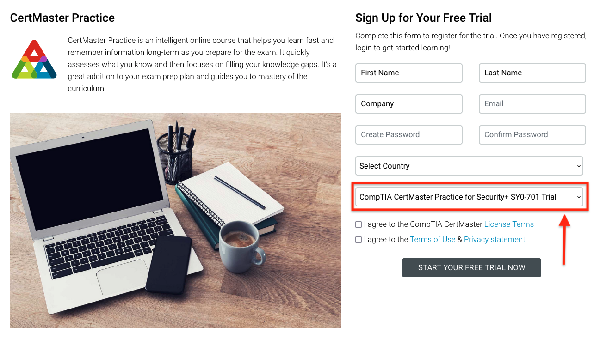

After you log in, the main dashboard will appear, as the following image shows:

   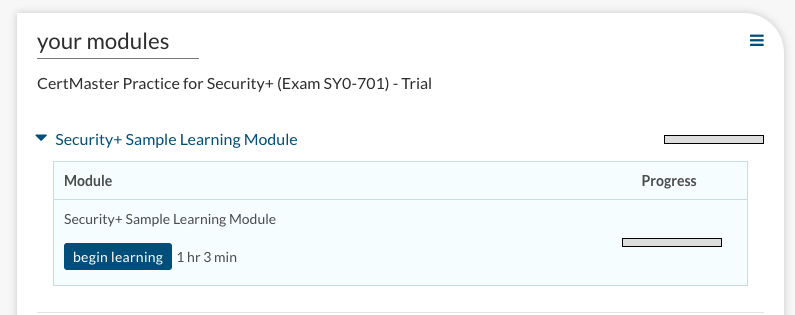

- This main dashboard contains:

  - The different modules of the Security+ exam (top left).
  - Your progress based on the percentage of practice completed (top right). 
  - The course overview comparing your statistics to all other participants using the CertMaster practice tool (bottom).
  
The modules do not have to be completed in a specific order.
  - To select a module, you will need to expand one of the domains.

  
For this walkthrough, we will expand the **Security+ Sample Learning Module** domain.
  - Select the dropdown arrow to display the sample module within **Security+ Sample Learning Module**, as the following image shows:
 
    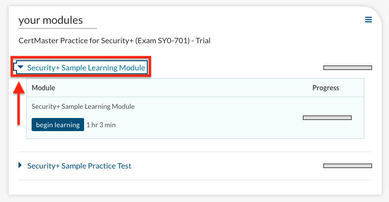

- There is only one module within **Security+ Sample Learning Module**.
  - The full version will include all of the domains for the certification.
  - The dashboard provides the following details on each module:
    - Topic of the module
    - Your progress on that specific module
    - The image provides a sample of what the full version will include.

     
  
We will select module **Security+ Sample Learning Module**.
  
  - Select **Begin Learning** under that module.
  
  - Note that questions will be mixed each time you begin a module, so what you see may vary. 
 
You can answer questions in one of two ways: 

  - If you are sure of an answer, click the corresponding circle twice to fully fill in the answer, as the following image shows: 
   
    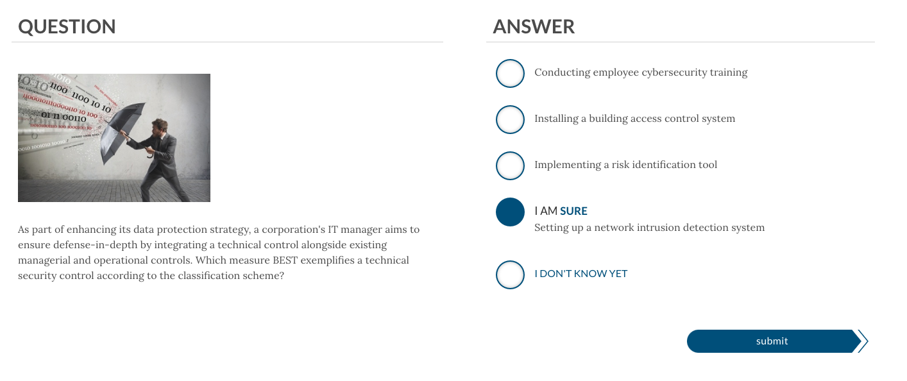 

  - If you are unsure, click on two answers, each one time, to suggest best but unsure guesses, as the following image shows: 

     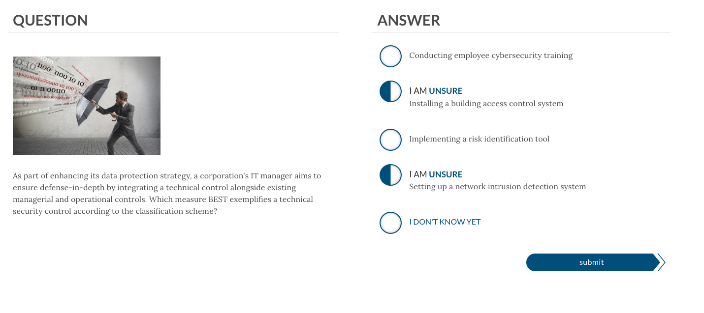 
    
     - **Note that this option is not available on the actual exam, only the CertMaster practice tool.**
      
  - If you submit multiple unsure answers, CertMaster will let you know if one of your choices was correct but will not tell you which one, as the following image shows:

      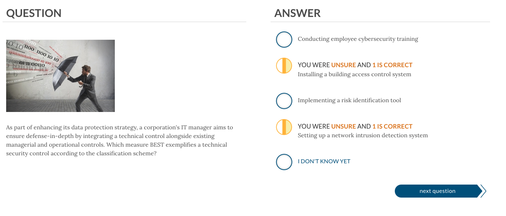 

  - You'll then be able to review your answers, as the following image shows:

     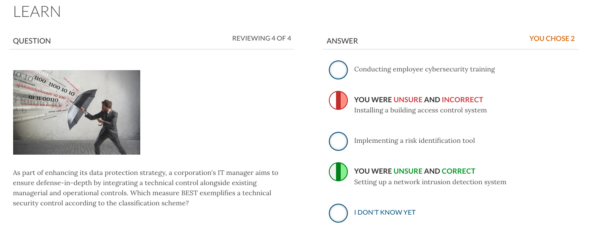 
 
  - At the end of the answer review page, a summary explains the answer, as the following image shows:
    
      
  
#### Additional Tips

While you are working on a module, you can view your current progress by clicking the arrow on the top right of your module, as the following image shows: 

  
 
- After you complete the module, you can view a summary of the completed modules.
  
  - From the dashboard, select **Course Report**, as the following image shows:
  
    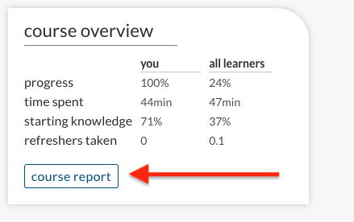
  
  - This provides a summary of all your completed modules.

  - Additionally, this page shows the most challenging questions, which you can return to and re-answer, as the following image shows: 
    
   
  
[<- Back to Module Contents](#module-day-1-contents)

---   

### 11. Activity: Security+ CertMaster

- [Activity File: Security+ CertMaster](Activities/03_CertMaster/Unsolved/Readme.md)

[<- Back to Module Contents](#module-day-1-contents)

---

### 12. Activity Review: Security+ CertMaster

[<- Back to Module Contents](#module-day-1-contents)

---

### 13. Security+ PBQs

The Security+ exam has two types of questions: multiple choice and **performance-based questions (PBQs)**. 
    
 - PBQs present test takers with a simulated environment, such as a network, firewall, or terminal. 

 - Since the question environment is simulated and not live, there may be some limitations compared to a real-world environment.

 - PBQs are often the first questions on the Security+ exam. 
  
In the next walkthrough, we'll explore some Security+ PBQ questions. 

#### PBQs Walkthrough

- Begin by accessing [CompTIA's PBQ simulation](https://demosim.comptia.io/), as the following image shows:
  
   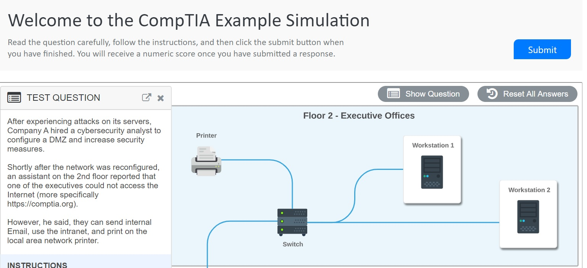  
  
  - This is an interactive question in which you can click on page elements.
  
  - Experience the interactivity by selecting **Workstation 1**. It will open a Windows command prompt, as the following image shows:
  
   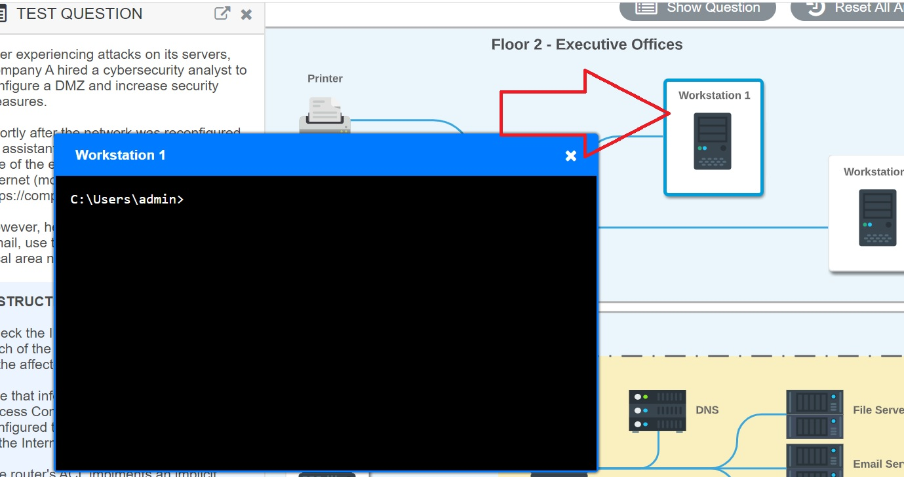    

- Scenarios and instructions are displayed on the left side of the screen, as the following image shows:
    
    
 
  - Always read the scenario and instructions carefully.
  
   - **Scenario:** After experiencing attacks on its servers, Company A hired a cybersecurity analyst to configure a DMZ and increase security measures. Shortly after the network was reconfigured, an assistant on the second floor reported that one of the executives could not access the internet (more specifically https://comptia.org). However, he said, they can send internal email, use the intranet, and print on the local area network printer.  
    
  - **Instructions:**
      - Check the IP addresses and connectivity for each of the workstations to determine which is the affected machine. 
      - Use that information to ensure that the access control list (ACL) is properly configured to allow all workstations access to the internet.
      - The router's ACL implements an implicit deny. Only make changes to correct the connectivity issue.

Now, we'll complete the steps to solve the PBQ.
  
1. Check the IP addresses and connectivity for each of the workstations to determine which is the affected machine. 

   -  To check the IP address of each machine, run `ipconfig`.
      - Since `C:\` indicates that this is a Windows machine, we use `ipconfig` instead of `ifconfig`.
   - Check connectivity to the website https://comptia.org:
      - Run `ping comptia.org`

   - Run these commands for each workstation.

      - **Workstation 1**

       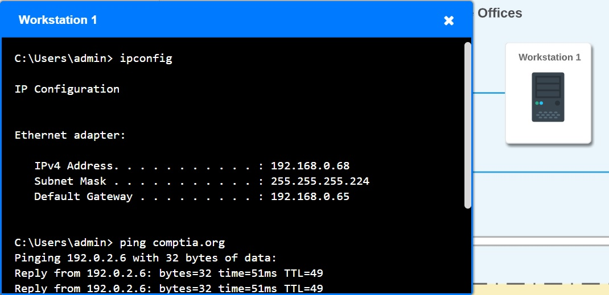

     - Workstation 1's IP address is `192.168.0.68`.
     
     - Workstation 1 received a successful ping response to comptia.org.
  
      - **Workstation 2**  

       

       - Workstation 2's IP address is `192.168.0.82`.
       - Workstation 2 received a failed ping response to comptia.org.
  
   - So far, we have determined that Workstation 2, with the IP `192.168.0.82`, is the workstation that can't access the internet.

2. Use that information to ensure that the ACL is properly configured to allow all workstations access to the internet. 

    - Since we need to ensure that the access control list allows all workstations to access the internet, we will:
      - Select the router that connects the workstations to the internet.

      -  View the ACL of that router, as the following image shows:
  
       
  
     - This ACL contains the rules for what traffic is allowed in and out of the router.

     - To remove a rule, click the yellow **x** to the right of the rule, as the following image shows:
  
       
    
   - Since Workstation 2 was the workstation experiencing a connectivity issue, we will first determine which subnet that workstation belongs to.

     - The only subnet `192.168.0.82` can belong to on the list is `192.168.0.80/28`.

     - `/28` means the IP range for this subnet is: `192.168.0.81` - `192.168.0.94`.

     - Explain that the rule setup for this subnet explains why the workstation can't access the internet. It is denying all access to any IP with any protocol and any port.

3. The router's ACL implements an implicit deny. Only make changes to correct the connectivity issue.

    - Remove this ACL rule to fix this connectivity issue by clicking the yellow **x**, as the following image shows:

       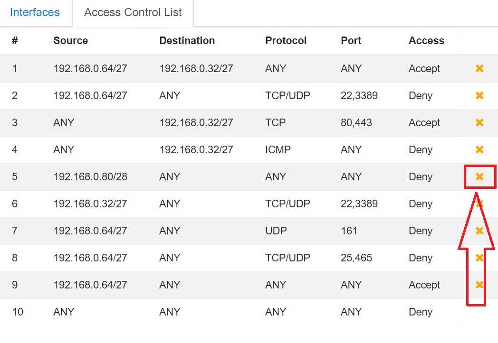

    - After clicking the yellow **x**, the ACL rule is removed, as the following image shows:

      

4. Finally, we need to submit our answers. 
  
   - Close the ACL page, and select **Submit** on the top right of the page, as the following image shows:

      

   - After selecting Submit, you will receive your score from this simulation, as the following image shows:

     

[<- Back to Module Contents](#module-day-1-contents)

---

### 14. Activity: Security+ PBQs

- [Activity File: Security+ PBQs](Activities/04_PBQ/Unsolved/Readme.md)
- [PBQs Practice Test](https://forms.gle/cqrgQX2jw1MU51t4A)
  
[<- Back to Module Contents](#module-day-1-contents)

---

### 15. Activity Review: Security+ PBQs

[<- Back to Module Contents](#module-day-1-contents)

---

&copy; 2024 edX Boot Camps LLC. Confidential and Proprietary. All Rights Reserved.  
